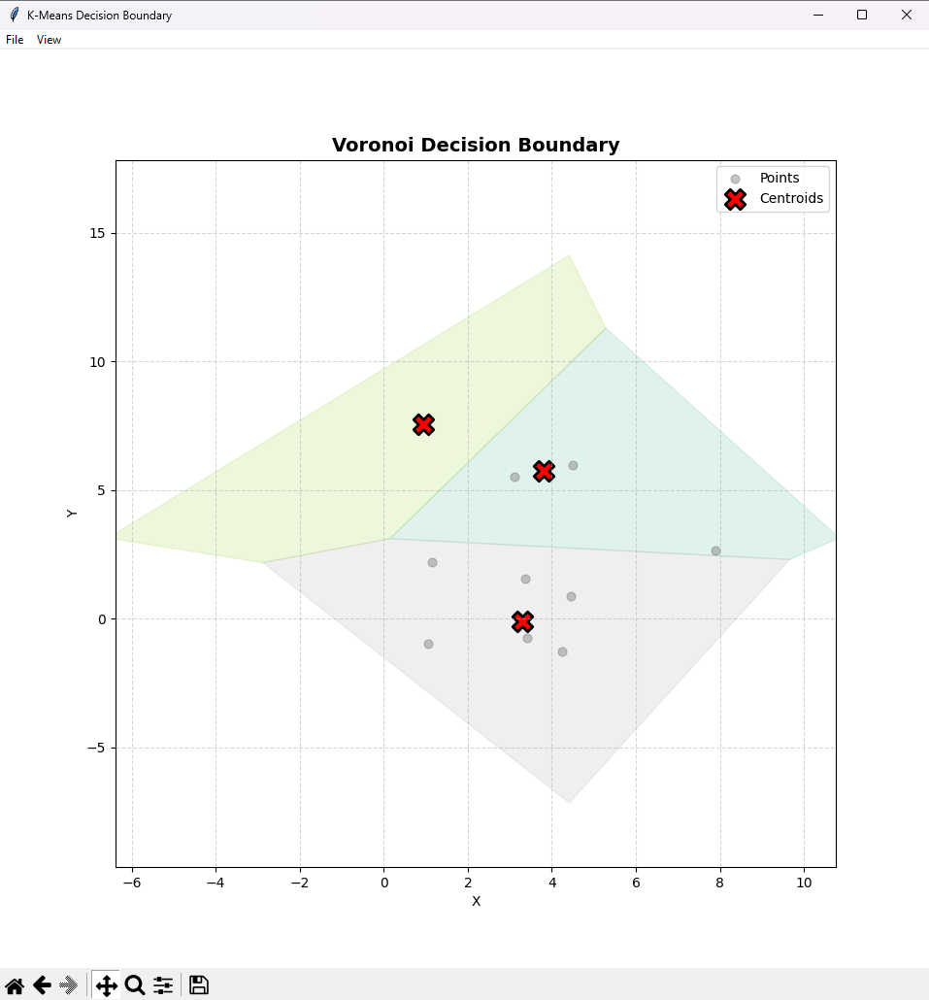
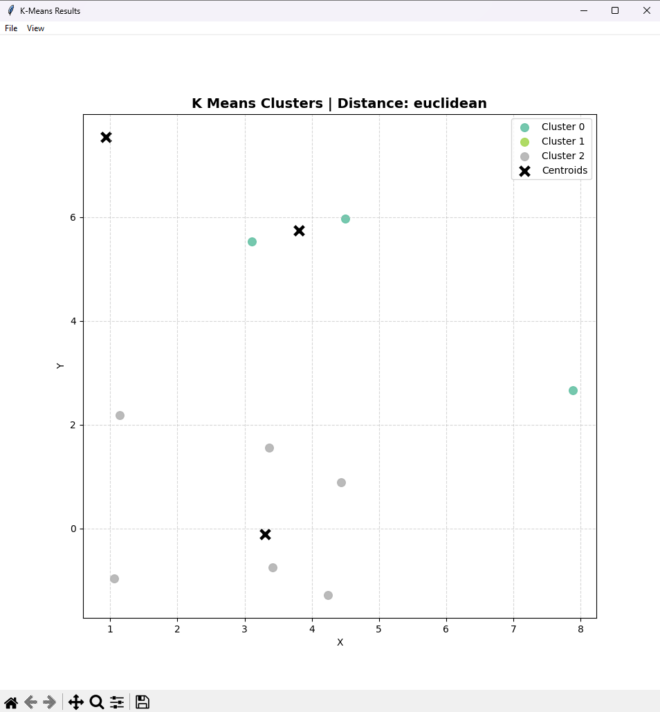
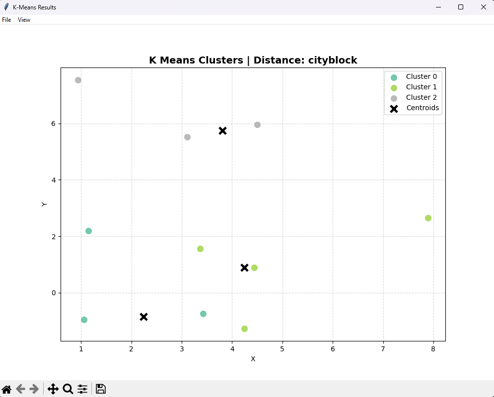
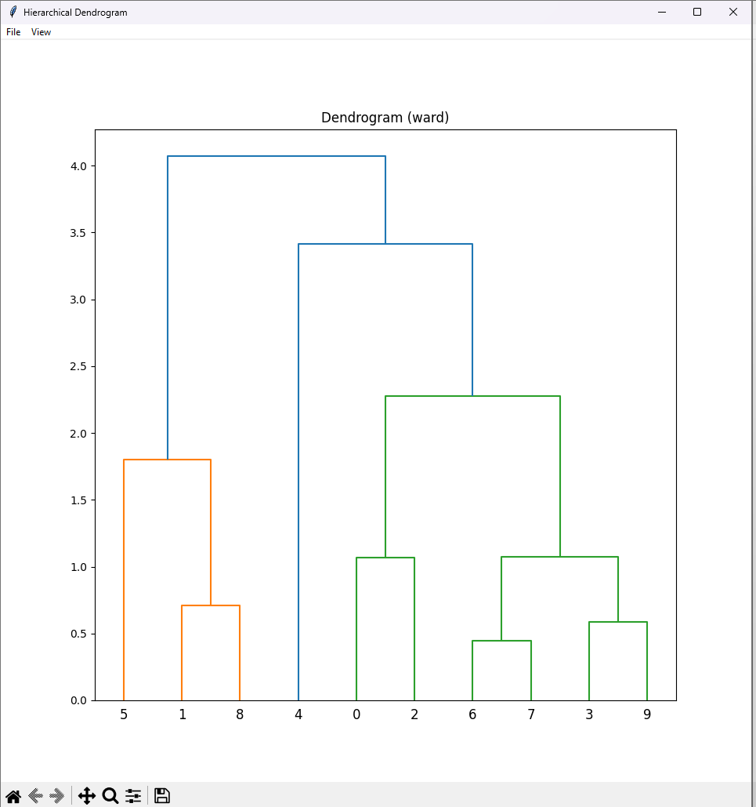
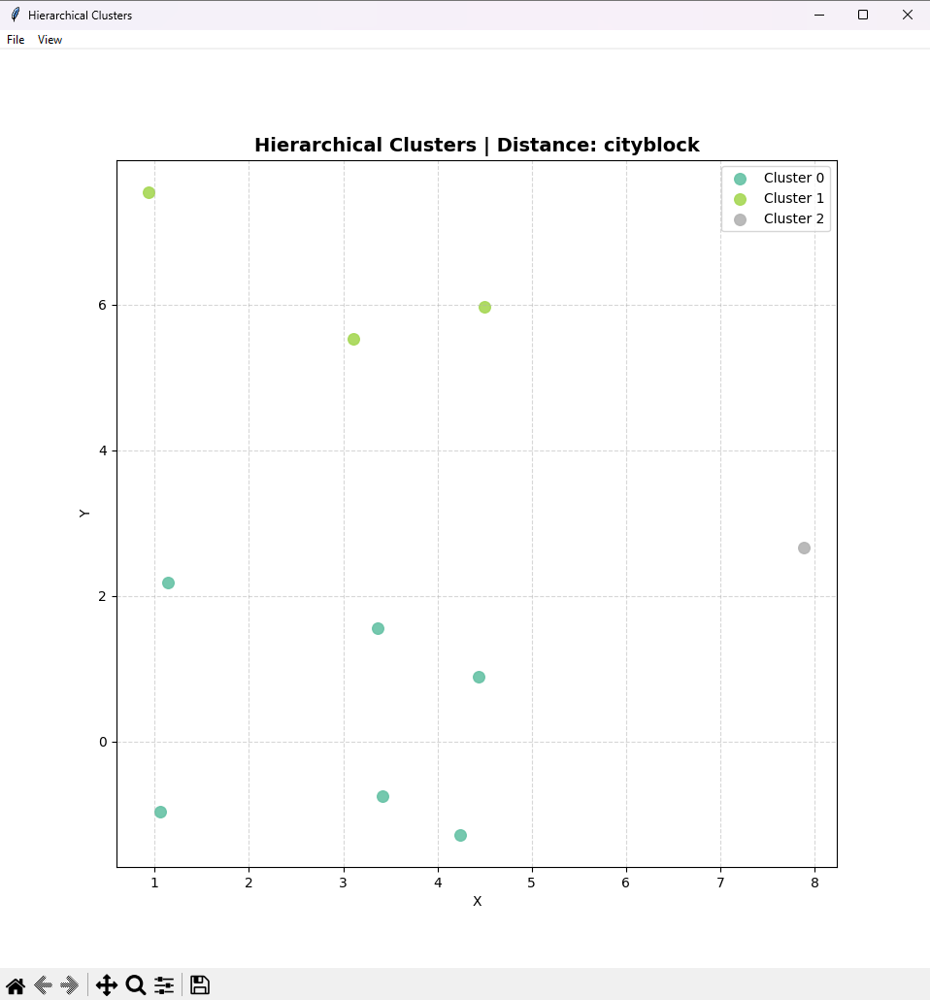
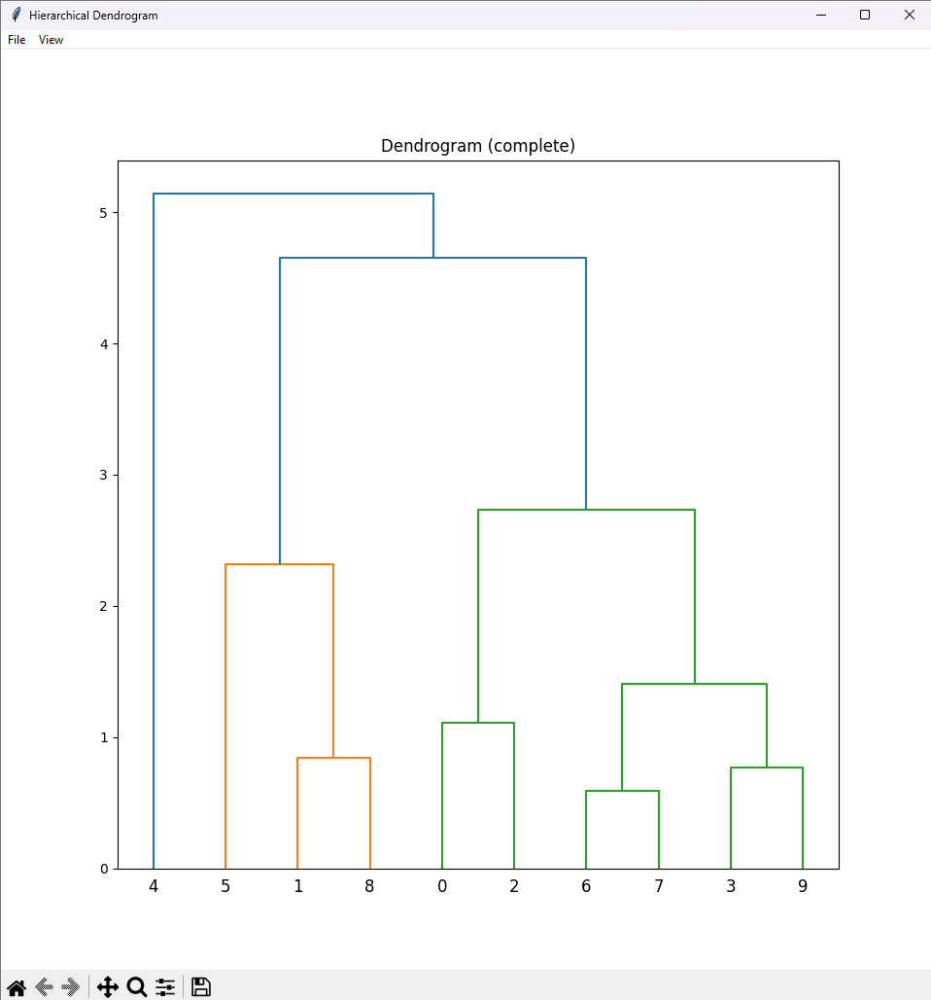

# Clustering Analysis Tool (K-Means & Hierarchical)

The **Clustering Analysis Tool** is an interactive, Python-based application designed to explore, analyze, and visualize clustering algorithms in two-dimensional space.  
It combines **algorithmic robustness**, **visual interpretability**, and a **user-friendly graphical interface**, making it suitable for both **learning purposes** and **practical experimentation**.

The tool allows users to apply different clustering techniques, observe how clusters are formed, analyze the effect of distance metrics, and visually inspect how **outliers influence (or do not influence) the clustering results**.

---

## Project Motivation

Clustering is a fundamental task in data analysis and machine learning. However, many standard implementations (such as classical K-Means) are **highly sensitive to outliers** and do not scale well for large datasets.

This project was created to:

- Study the behavior of clustering algorithms under **realistic conditions**
- Reduce the negative impact of **outliers**
- Provide **clear visual feedback** through plots and decision boundaries
- Offer a flexible framework that adapts to **small, medium, and large datasets**

Special emphasis is placed on **robust centroid estimation** and **scalable hierarchical methods**.

---

## Key Features

### Advanced K-Means

The K-Means implementation in this project goes beyond the standard algorithm by introducing several robustness and performance improvements:

- **K-Means++ initialization**  
  Improves convergence speed and reduces poor initial centroid placement.

- **Trimmed centroid computation**  
  A percentage of the farthest points inside each cluster is ignored when computing centroids.  
  This significantly reduces the influence of outliers.

- **MiniBatch K-Means**  
  Automatically selected for large datasets to improve runtime efficiency while maintaining good clustering quality.

- **Bisecting K-Means**  
  Used when the number of clusters `k` is large, recursively splitting clusters to achieve better structure.

- **Supported distance metrics**
  - `euclidean` – standard geometric distance
  - `cityblock` (Manhattan) – more robust to extreme values

This adaptive approach ensures that the algorithm selects the most appropriate strategy depending on dataset size and configuration.

---

### Hierarchical Clustering

The tool also includes a flexible hierarchical clustering pipeline with automatic method selection:

- **Ward linkage** (Euclidean distance)  
  Minimizes within-cluster variance.

- **Complete linkage** (Manhattan distance)  
  More robust to irregular cluster shapes.

- **Fastcluster acceleration**  
  Used automatically if the library is available, significantly improving performance.

- **BIRCH clustering**  
  Applied for very large datasets (`n > 20,000`) to maintain scalability.

- **Automatic dendrogram generation**  
  Generated only when feasible to avoid performance degradation.

This design allows hierarchical clustering to scale from small academic examples to large synthetic datasets.

---

### Visualization Capabilities

Visualization is a core component of this project, allowing users to **interpret clustering behavior visually**:

- 2D scatter plots of clustered data
- Clear color-coded cluster separation
- Centroid markers
- **Voronoi Decision Boundaries** (available for Euclidean distance)
- Interactive plot windows with:
  - Grid toggle
  - Legend toggle
  - Export to PNG, JPG, or PDF

Voronoi diagrams help illustrate how the feature space is partitioned by centroids, providing intuitive insight into decision regions.

---

## Outlier Handling Philosophy

Instead of blindly removing outliers, this project follows a **robust clustering philosophy**:

- Outliers are **not removed by default**
- Their influence is **mitigated** through trimmed centroid computation
- This preserves potentially meaningful rare observations while preventing centroid distortion

This approach is especially suitable for:

- Exploratory data analysis
- Educational demonstrations
- Real-world datasets with noise

---

## Project Structure

```text
project/
│
├── core/
│   ├── dataloader.py
│   ├── kmeans.py
│   └── hierarchical.py
│
├── visualization/
│   ├── plot_clusters.py
│   ├── plot_voronoi.py
│   └── popup.py
│
├── ui/
│   └── main_window.py
│
├── main.py
└── sampledata.csv
```

---

# Example

**Purpose:**  
This example demonstrates the robustness of the K-Means implementation against extreme outliers.  
The centroid should remain close to the dense region of points and should not be significantly influenced by the outlier.

### Parameters

- Algorithm: **K-Means/Hierarchical**
- Number of clusters (`k`): **3**

### Input Points

```text
1.06,-0.96
4.50,5.97
1.14,2.19
3.36,1.56
7.89,2.66
0.94,7.55
3.42,-0.75
4.24,-1.28
3.11,5.53
4.44,0.89
```

## K-Means Clustering - Output

### Eucledian

<div style="display: flex;">


</div>

### Cityblock

<div style="display: flex;">

</div>

## Hierarchical Clustering - Output

### Eucledian

<div style="display: flex;">


</div>

### Cityblock

<div style="display: flex;">


</div>

## Project Download

The complete project source code is available for download via the GitHub repository.

You can access the repository using the link below:

🔗 **GitHub Repository:**  
*https://github.com/BlertinH/28-Cluster-Analysis-Using-K-Means-and-Hierarchical-Clustering*

Alternatively, the project can be downloaded as a ZIP archive directly from GitHub:

1. Open the repository link
2. Click **Code**
3. Select **Download ZIP**
4. Extract the archive and run the project locally

This repository contains all source files, example data, and documentation required to run the application.

---

## Group Members

This project was developed as part of a group assignment.  
The following members contributed to the design, implementation, and testing of the system:

- _Elisa Gjurkaj_
- _Blertin Hamza_
- _Valëza Sutaj_
- _Uranit Vuçitërna_
- _Erik Behrami_
